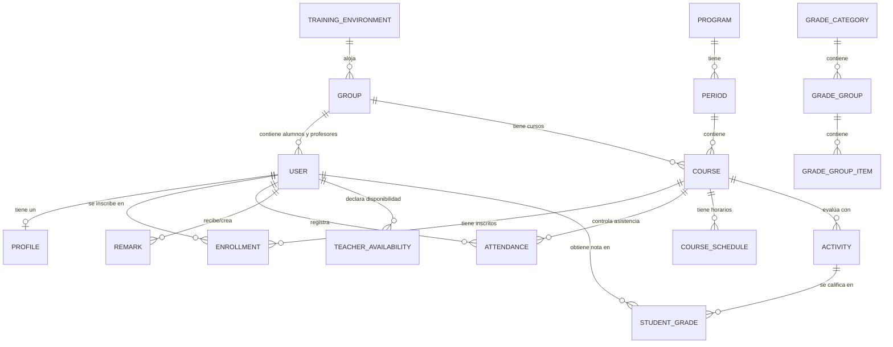

# Documentación Completa de AcademiX

AcademiX es una plataforma integral de gestión académica, control de asistencia, seguimiento conductual (observador digital) y planificación horaria, diseñada específicamente para centros de formación técnica y profesional (basada en el modelo educativo del **SENA - Servicio Nacional de Aprendizaje** de Colombia).

La plataforma conecta en tiempo real a tres actores principales: **Administradores**, **Instructores** y **Aprendices (Estudiantes)**, permitiendo automatizar los procesos de programación, evaluación jerárquica y analítica del rendimiento.

---

## Índice
1. [Arquitectura y Roles de Usuario](#1-arquitectura-y-roles-de-usuario)
2. [Módulo de Gestión Académica (Administrador)](#2-módulo-de-gestión-académica-administrador)
3. [Módulo de Planificación y Gestión Horaria](#3-módulo-de-planificación-y-gestión-horaria)
4. [Módulo del Instructor (Gestión de Fichas)](#4-módulo-del-instructor-gestión-de-fichas)
5. [Módulo del Aprendiz (Portal de Estudiante)](#5-módulo-del-aprendiz-portal-de-estudiante)
6. [Módulo de Ambientes de Formación](#6-módulo-de-ambientes-de-formación)
7. [Configuración Global y Personalización del Sistema](#7-configuración-global-y-personalización-del-sistema)
8. [Modelo de Base de Datos (Esquema Prisma)](#8-modelo-de-base-de-datos-esquema-prisma)

---

## 1. Arquitectura y Roles de Usuario

La plataforma implementa un control de acceso basado en roles (RBAC) estructurado de la siguiente forma:

### 👤 Administrador (Admin)
Tiene control total sobre la plataforma. Su responsabilidad principal es la carga de datos institucionales, la planificación de la infraestructura académica (ambientes, instructores, programas), el diseño y validación de horarios, y la resolución de solicitudes extraordinarias (como la modificación extemporánea de asistencias).

### 👥 Instructor (Profesor/Docente)
Encargado de guiar el proceso formativo de los grupos (Fichas) asignados. Sus funciones incluyen tomar asistencia diaria, diligenciar el observador del aprendiz, estructurar el plan de calificación de la competencia, calificar actividades, compartir recursos de aprendizaje y coordinar dinámicas de grupo.

### 🎓 Aprendiz (Estudiante)
Usuario final en proceso de aprendizaje. Sus funcionalidades están enfocadas a la consulta: visualización de horarios personalizados, descarga de guías y material de clase compartido por el instructor, revisión detallada de calificaciones con ponderaciones, firma de consentimiento de datos y justificación digital de inasistencias.

---

## 2. Módulo de Gestión Académica (Administrador)

Este módulo (implementado en [AcademicManagement.tsx](file:///c:/Users/Jhon/Documents/Datos/Informacion/2026/Proyectos/Academix/src/features/admin/components/AcademicManagement.tsx)) es el corazón administrativo de la plataforma, y consta de las siguientes pestañas:

*   **Vista General (Overview):** Muestra tarjetas con métricas consolidadas (total de periodos, grupos, estudiantes, profesores y ambientes de formación) junto con accesos rápidos.
*   **Periodos y Materias:** 
    *   Permite estructurar las divisiones temporales (trimestres, semestres o periodos específicos) de un programa de formación.
    *   Administración de **Materias / Competencias**: creación de cursos dentro de cada periodo con título, descripción, URL externa de apoyo (por ejemplo, Google Classroom o Moodle), horas semanales sugeridas, y etiquetas de color/iconos para diferenciación visual.
*   **Grupos y Alumnos (Fichas):** 
    *   Creación y edición de Grupos (Fichas de caracterización) con fecha de inicio, fecha de fin y jornada de formación (hora de inicio y fin estándar).
    *   **Asignación de Estudiantes:** Permite registrar estudiantes individualmente de forma manual o realizar cargas masivas a través de plantillas de **Excel**. También admite la reubicación de estudiantes entre diferentes grupos de manera ágil.
*   **Profesores:**
    *   Visualización del listado de instructores calificados.
    *   Asignación de las competencias que cada docente está calificado para dictar.
    *   Límites de carga horaria semanales individuales.
    *   Bloqueo o desbloqueo del perfil del docente para impedir que edite su disponibilidad horaria o materias asignadas.
*   **Ambientes:**
    *   Administración de espacios físicos o virtuales de aprendizaje (Aulas de informática, laboratorios, talleres de soldadura, etc.) definiendo su capacidad y recursos disponibles.

---

## 3. Módulo de Planificación y Gestión Horaria

El sistema incorpora un potente motor de generación de horarios académicos (implementado en [SchedulePlanning.tsx](file:///c:/Users/Jhon/Documents/Datos/Informacion/2026/Proyectos/Academix/src/features/admin/components/SchedulePlanning.tsx) y [CalendarGroupGrid.tsx](file:///c:/Users/Jhon/Documents/Datos/Informacion/2026/Proyectos/Academix/src/features/admin/components/CalendarGroupGrid.tsx)) que resuelve los problemas de traslapes en tiempo real.

### 📅 Planificador Interactivo
*   Permite seleccionar una Ficha (Grupo) y arrastrar/bloquear bloques horarios de competencias específicas.
*   Presenta una cuadrícula visual estructurada de lunes a domingo con intervalos configurables.

### 🚫 Detección de Colisiones (Validación en Tiempo Real)
El planificador evalúa de manera automática tres tipos de colisiones:
1.  **Colisión del Instructor:** Advierte si se intenta programar a un docente en un horario donde ya tiene una clase asignada con otro grupo.
2.  **Colisión de Ambiente:** Evita la sobreasignación de un aula física o laboratorio para dos clases simultáneas.
3.  **Límites de Reglas de Negocio:**
    *   **Horas Máximas del Instructor:** Controla que el docente no exceda las horas de contrato parametrizadas en los ajustes globales (por ejemplo, 40 horas semanales).
    *   **Límites Diarios de Aprendiz:** Restringe la carga horaria diaria máxima por ficha para asegurar la salud pedagógica.
    *   **Disponibilidad Horaria declarada:** Valida si el horario propuesto coincide con los bloques declarados previamente por el instructor.

### 📢 Estado de Publicación (Borrador vs. Publicado)
*   Los horarios creados permanecen en estado **Borrador** hasta que el administrador valida todo el programa y presiona el botón "Publicar".
*   Una vez publicados, el horario se refleja en los dashboards de los instructores y estudiantes correspondientes.
*   **Eventos y Festivos:** Permite registrar feriados o jornadas especiales (`ScheduleEvent`) para suspender el cálculo de horas y alertar visualmente en los calendarios.

---

## 4. Módulo del Instructor (Gestión de Fichas)

Es la herramienta de trabajo diaria del docente (implementada en [GroupManager.tsx](file:///c:/Users/Jhon/Documents/Datos/Informacion/2026/Proyectos/Academix/src/features/teacher/components/GroupManager.tsx)). Al acceder a una de sus materias asignadas, se despliegan las siguientes opciones:

### A. Directorio de Estudiantes
*   Muestra el listado de aprendices matriculados en la competencia con su foto, datos de contacto e identificación.
*   Estadísticas individuales rápidas: porcentaje de inasistencias acumulado y promedio general de notas.

### B. Registro de Asistencias (Asistencia)
*   **Control Diario:** Permite marcar para cada sesión el estado del aprendiz: **Presente (Present)**, **Ausente (Absent)**, **Tarde (Late)** o **Retiro Temprano (Leave Early)**.
*   **Restricción Semanal y Permisos Especiales:**
    *   Por motivos de auditoría académica, la plataforma puede limitar el registro a la semana en curso (según la configuración global).
    *   Si se requiere registrar o editar una asistencia de semanas anteriores, el instructor debe diligenciar un formulario de **Solicitud de Permiso de Edición** justificando los motivos.
    *   El Administrador recibe la solicitud en su bandeja de ajustes globales y puede **Aprobar** o **Rechazar** el permiso de modificación extemporánea.

### C. Observador Digital (Bitácora de Observaciones)
*   Permite llevar el historial conductual y académico individual de cada aprendiz.
*   **Tipos de Observaciones:**
    *   `ATTENTION` (Llamado de atención)
    *   `COMMENDATION` (Felicitación / Reconocimiento)
    *   `CITATION` (Citación a plan de mejoramiento o comité)
    *   `OTHER` (Otras notas formativas)
*   **Plantillas (RemarkTemplate):** El instructor puede guardar plantillas de texto de uso frecuente para optimizar la redacción de las anotaciones.
*   **Acuse de Recibo:** El sistema registra la fecha y hora exacta (`viewedAt`) en que el aprendiz abre y visualiza por primera vez la anotación en su portal.

### D. Calificaciones Ponderadas Jerárquicas
AcademiX implementa un modelo de calificación flexible y altamente estructurado (coordinado por [GradesManager.tsx](file:///c:/Users/Jhon/Documents/Datos/Informacion/2026/Proyectos/Academix/src/features/teacher/components/GradesManager.tsx) y [gradeUtils.ts](file:///c:/Users/Jhon/Documents/Datos/Informacion/2026/Proyectos/Academix/src/lib/gradeUtils.ts)):
*   **Categorías de Notas:** Por ejemplo, cortes académicos ("Primer Corte" 30%, "Segundo Corte" 30%, "Tercer Corte" 40%).
*   **Grupos de Calificación:** Dentro de cada categoría se definen grupos de actividades (por ejemplo, "Talleres" 40%, "Exámenes" 60%).
*   **Actividades Académicas:** Se asocian las tareas prácticas, cuestionarios o exposiciones a su respectivo grupo con un peso ponderado interno.
*   **Flujo de Entrega:**
    *   El instructor puede activar la opción de **Evidencia Digital**, lo que habilita al aprendiz a adjuntar un enlace web (GitHub, Google Drive, etc.) con su desarrollo.
    *   El instructor califica sobre la escala establecida (ej. 0.0 a 5.0), agrega comentarios de retroalimentación y evalúa las evidencias enviadas.
*   **Exportación Jerárquica a Excel:** Genera planillas Excel estilizadas con encabezados multinivel combinados, promedios intermedios por corte y nota definitiva calculada automáticamente de acuerdo a los pesos.

### E. Material Compartido (Documentation / Shared Content)
*   Facilita la distribución de material pedagógico para las sesiones de clase.
*   El instructor puede compartir:
    *   **Enlaces externos:** Direcciones URL estructuradas con etiquetas descriptivas.
    *   **Fragmentos de Código (Snippets) y Archivos de Texto:** Editor de código integrado para guardar scripts (en múltiples lenguajes de programación) que los estudiantes pueden copiar o descargar directamente.

### F. Herramientas de Dinámica Grupal
*   **Ruleta de Selección Aleatoria (Roulette.tsx):** Un selector visual interactivo para elegir aprendices al azar de la lista. Ideal para preguntas de control, exposiciones o turnos de participación.
*   **Creador de Grupos de Trabajo (WorkGroupManagerDialog.tsx):** Permite dividir de forma manual o aleatoria el aula en sub-equipos de trabajo cooperativo para proyectos integradores.

### G. Analítica de Ficha (Analytics)
*   Presenta gráficos dinámicos y tableros estadísticos con la deserción de asistencia, distribución de notas, horas acumuladas dictadas y alertas tempranas de estudiantes en riesgo de reprobación por faltas o bajo rendimiento.

---

## 5. Módulo del Aprendiz (Portal de Estudiante)

El estudiante cuenta con una interfaz simplificada y visualmente optimizada (coordinada por [StudentDashboard.tsx](file:///c:/Users/Jhon/Documents/Datos/Informacion/2026/Proyectos/Academix/src/features/student/components/StudentDashboard.tsx)) orientada al autocontrol de su progreso académico:

### 🏠 Panel Principal (Dashboard)
*   Visualización de las clases asignadas para el día actual con información de hora, competencia, instructor y aula/ambiente.
*   Notificaciones de últimas calificaciones publicadas y nuevas observaciones añadidas a su observador digital.

### 📅 Horario Académico Completo
*   Acceso a un calendario interactivo en formato mensual y semanal.
*   Diferenciación por colores para identificar rápidamente las materias e integración de enlaces a aulas virtuales asignadas.

### 📝 Boletín de Calificaciones Detallado
*   Muestra la estructura jerárquica de la competencia (Categorías > Grupos > Actividades).
*   Permite ver la nota obtenida en cada taller o examen, el porcentaje que representa sobre el grupo, la retroalimentación escrita del docente, y el enlace de la evidencia enviada.
*   Visualiza el promedio acumulado en tiempo real en cada categoría y la proyección de la nota final de la competencia.

### 📋 Observador del Aprendiz (StudentRecords.tsx)
*   Historial centralizado de todos los registros del observador.
*   El estudiante puede exportar su **Ficha de Aprendiz** completa en formato digital o PDF de impresión, útil para trámites de bienestar estudiantil o coordinación académica.

### ⏱️ Control de Asistencia y Justificación de Faltas
*   Módulo para revisar el desglose de asistencias, tardanzas e inasistencias en cada materia.
*   **Justificación Digital:** Ante una inasistencia (marcada como `ABSENT`), el aprendiz puede hacer clic en un botón para subir un soporte (justificación médica, laboral o calamidad doméstica) en formato de enlace/URL para la posterior revisión y aprobación del instructor.

---

## 6. Módulo de Ambientes de Formación

La gestión de la infraestructura física del centro de formación se realiza a través de la entidad `TrainingEnvironment`:

*   **Capacidad y Locación:** Cada ambiente cuenta con un cupo máximo de estudiantes configurado para evitar la asignación a grupos que superen dicho aforo.
*   **Recursos Inventariados:** Listado dinámico de recursos asignados al ambiente (ej. "Proyector", "30 computadores de escritorio", "Tablero digital interactivo", "Aire acondicionado").
*   **Disponibilidad Horaria:** El sistema cruza de forma estricta los horarios de las Fichas programadas en el ambiente para garantizar que ningún espacio físico sea asignado a dos instructores o grupos en el mismo bloque horario.

---

## 7. Configuración Global y Personalización del Sistema

La personalización global de AcademiX se realiza desde el panel administrativo (`SystemSettings`):

*   **Identidad Institucional:** Permite modificar el nombre de la institución, cargar logotipos del centro educativo, cambiar el logotipo del sitio, configurar los enlaces de redes sociales y personalizar la imagen de bienvenida (Hero) del portal de acceso.
*   **Ajustes de Interfaz Visual:**
    *   **Modo de Tema Global:** Selección entre temas claros, oscuros o predeterminados del sistema.
    *   **Paletas de HSL:** Definición del color de acento de la interfaz (zinc, azul, esmeralda, etc.).
    *   **Personalización de Código:** Selección del tema de sintaxis para el editor de documentación de los docentes (ej. One Dark Pro, VS Light).
*   **Parámetros Operativos del Centro:**
    *   **Límite Diario de Accesos:** Restricción de inicios de sesión diaria por aprendiz para prevenir saturación de peticiones de base de datos.
    *   **Límite de Horas de Instructor:** Límite estándar de carga horaria semanal (ej. 40 horas).
    *   **Asistencia Restringida:** Habilitación o inhabilitación de la regla de bloqueo de edición de asistencia fuera de la semana corriente.

---

## 8. Modelo de Base de Datos (Esquema Prisma)

El sistema utiliza **Prisma ORM** con una base de datos **PostgreSQL**. A continuación se detalla la estructura relacional de los modelos de datos principales definidos en [schema.prisma](file:///c:/Users/Jhon/Documents/Datos/Informacion/2026/Proyectos/Academix/prisma/schema.prisma):

### Detalle de las Entidades Principales

#### `User` (Usuario)
Almacena las credenciales y el estado del usuario en la plataforma.
*   `id`, `name`, `email`, `role` (indica si es `"admin"`, `"teacher"` o `"student"`).
*   `banned` (booleano), `banReason` y `banExpires` para control de suspensión de accesos.
*   `availabilityLocked` y `qualifiedCoursesLocked` para restringir la modificación del docente.

#### `Profile` (Perfil)
Información sensible y de contacto adicional del usuario.
*   `identificacion` (cédula o documento de identidad).
*   `nombres`, `apellido`, `telefono`.
*   `dataProcessingConsent` (Firma digital de Habeas Data).

#### `Course` (Curso / Competencia)
Competencias de formación asignadas a los instructores y grupos.
*   `title`, `description`, `externalUrl` (enlace a Moodle/Classroom), `weeklyHours`.
*   `usePercentageWeights` (indica si la calificación final del curso se calculará basada en los porcentajes de las categorías).
*   `periodId` (relación a Periodo) y `groupId` (relación a Grupo).

#### `Attendance` (Asistencia)
Control de presencia diaria del aprendiz.
*   `date` (fecha de la sesión).
*   `status` (enum: `PRESENT`, `ABSENT`, `LATE`, `LEAVE_EARLY`).
*   `arrivalTime` y `departureTime` para registrar horas exactas de entrada y salida.
*   `justification` y `justificationUrl` (soporte digital de inasistencia).

#### `Remark` (Observación / Anotación del Observador)
Entradas en la bitácora disciplinaria y académica.
*   `type` (enum: `ATTENTION`, `COMMENDATION`, `CITATION`, `OTHER`).
*   `title`, `description`, `date`.
*   `viewedAt` (marca temporal que registra cuándo el estudiante leyó la anotación).

#### `CourseSchedule` (Horario de Competencia)
Define los bloques horarios de las materias.
*   `dayOfWeek` (enum: `MONDAY` hasta `SUNDAY`).
*   `startTime` y `endTime` (formato texto `"HH:mm"`, ej. `"08:00"`).

#### `Activity` (Actividad Académica)
Tareas evaluables creadas por el docente.
*   `title`, `description`, `weight` (porcentaje sobre el grupo de notas).
*   `allowSubmissionLink` (booleano que habilita entregas digitales al aprendiz).

#### `StudentGrade` (Calificación del Aprendiz)
Resultados de la evaluación de actividades.
*   `score` (nota flotante en escala decimal).
*   `feedback` (retroalimentación pedagógica escrita por el instructor).
*   `submissionLink` (URL de la evidencia entregada por el aprendiz).
